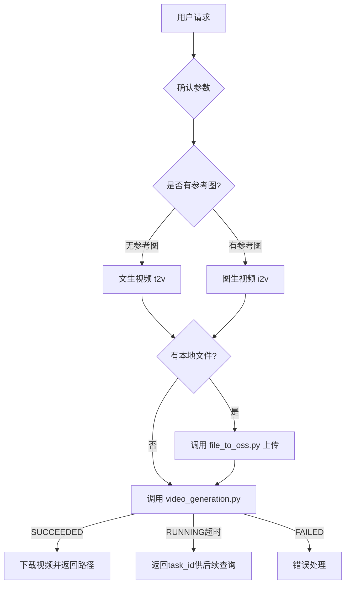

---
name: wan2.7-video-skill
description: 基于 wan2.7 视频生成模型，支持文本生成视频（文生视频）、图像生成视频（图生视频）和视频续写三种模式。适用于视频创作、短视频生成、动画制作等场景。主要覆盖以下三类任务：1、文生视频——如"帮我生成一段小猫奔跑的视频"、"生成一段15秒的雨夜街头场景"等；2、图生视频——如"把这张图片变成动态视频"、"根据首尾帧生成过渡视频"等；3、视频续写——如"帮我续写这段视频"、"让这段视频继续播放"等。触发条件：只要用户意图涉及 AI 驱动的视频创作、生成、制作、续写——无论其表述是直接指令（如"生成视频"）、口语化请求（如"帮我做段视频"）还是隐含需求（如"让这张图动起来"）——均应激活本技能。
---

# Wan2.7 Video Generation Skill (Wan2.7 视频生成技能)

Generate AI videos with "Wan2.7 Video" via direct API calls.

---

## Quick Start

**1. 配置环境** → [common.md](references/common.md)  
**2. 了解能力** → 阅读下文核心能力介绍  
**3. 确认参数** → 询问用户需要的参数配置（重要！）  
**4. 选择模式** → 根据需求选择两种操作模式之一  
**5. 详细用法** → [video-generation.md](references/video-generation.md)

**核心能力:**
- ✓ **文生视频**: 纯文本生成视频，支持多镜头叙事、音频输入、自动配音
- ✓ **图生视频**: 基于首帧/首尾帧图片生成视频，支持音频驱动
- ✓ **视频续写**: 基于已有视频片段生成后续内容

---

## Workflow: Video Generation (视频生成流程)



**流程说明:**

### Step 1: 确认用户参数（必须！）

**⚠️ 重要: 在调用脚本之前，必须先向用户确认以下参数。** 不要直接使用默认值跳过询问。如果用户的请求中已经包含了某些参数，则只需确认剩余未指定的参数。

**文生视频 (t2v) 需要确认的参数:**

| 参数 | 说明 | 可选值 | 默认值 |
|------|------|--------|--------|
| `prompt` | 视频内容的文字描述 | 任意文本 | **必填** |
| `resolution` | 分辨率档位 | 720P, 1080P | 1080P |
| `ratio` | 宽高比 | 16:9, 9:16, 1:1, 4:3, 3:4 | 16:9 |
| `duration` | 视频时长（秒） | 2~15 整数 | 5 |
| `negative_prompt` | 不想出现的元素 | 任意文本 | 无 |
| `prompt_extend` | 智能改写 prompt | 开/关 | 开 |
| `watermark` | 添加"AI生成"水印 | 开/关 | 关 |
| `seed` | 随机种子（可复现） | 0~2147483647 | 随机 |
| `audio_url` | 自定义音频 URL | URL 或不填(自动配音) | 自动配音 |

**图生视频 (i2v) 需要确认的参数:**

| 参数 | 说明 | 可选值 | 默认值 |
|------|------|--------|--------|
| `image` | 参考图片 URL 或本地文件 | URL / 本地路径 | **必填** |
| `prompt` | 可选的视频描述 | 任意文本 | 无 |
| `resolution` | 分辨率 | 如 832*480 | 832*480 |

**确认策略:**
- 如果用户只说"帮我生成视频"但没有指定任何参数 → 至少询问 prompt、resolution、ratio、duration
- 如果用户已给出 prompt 和部分参数 → 只确认剩余参数，已明确的不再问
- 如果用户明确说"用默认参数" → 全部使用默认值，不再追问
- 对于 resolution 和 duration，提醒用户这些参数直接影响费用

### Step 2: 判断模式

根据是否有参考图以及用户内容，选择文生视频还是图生视频

### Step 3: 预处理脚本执行

根据输入情况自动选择:
- **有文件路径**: 调用 `scripts/file_to_oss.py --file` 上传文件到 OSS
- **有 base64 数据**（如聊天框粘贴场景）: 调用 `scripts/file_to_oss.py --base64` 上传到 OSS

### Step 4: 调用生成脚本

调用 `scripts/video_generation.py`，根据确认的参数进行调用

### Step 5: 获取结果

从响应中提取视频 URL（有效期 24 小时），自动下载到用户指定目录

### Step 6: 展示结果

把视频文件路径在用户交互界面中显示出来，提示用户视频链接有有效期，建议及时保存

⚠️ **重要: 绝对不要用 Read 工具读取下载后的视频文件!** 读取视频会触发 API 报错。下载完成后只需告诉用户文件路径，让用户自行打开查看。

📖 **详细流程与参数:** [video-generation.md](references/video-generation.md)

---

## Three Operation Modes (三种操作模式)

### Mode 1: 文生视频 (Text-to-Video)

**用途:** 纯文本生成视频

**输入:** 文本提示词  
**输出:** MP4 视频文件  
**特点:** 支持多镜头叙事、音频输入、自动配音、反向提示词

**关键参数:**
- `resolution`: 分辨率档位 720P 或 1080P（默认 1080P）
- `ratio`: 宽高比 16:9/9:16/1:1/4:3/3:4（默认 16:9）
- `duration`: 时长 2~15 秒（默认 5）
- `prompt_extend`: 智能改写（默认开启）
- `audio_url`: 自定义音频 URL

📖 **详细说明与用例:** [video-generation.md#mode-1](references/video-generation.md)

---

### Mode 2: 图生视频 (Image-to-Video)

**用途:** 基于图片生成视频

**输入:** 首帧图片 + 可选尾帧图片 + 可选音频 + 可选文本提示词  
**输出:** MP4 视频文件  
**特点:** 支持首帧生视频、首尾帧生视频、音频驱动（口型同步/动作卡点）

**关键参数:**
- `first_frame`: 首帧图片 URL（必填）
- `last_frame`: 尾帧图片 URL（可选）
- `audio_url`: 驱动音频 URL（可选）
- `resolution`: 720P 或 1080P（默认 720P，宽高比跟随输入图片）
- `duration`: 时长 2~15 秒（默认 5）

📖 **详细说明与用例:** [video-generation.md#mode-2](references/video-generation.md)

---

### Mode 3: 视频续写 (Video Continuation)

**用途:** 基于已有视频片段生成后续内容

**输入:** 首段视频 URL + 可选尾帧图片 + 可选文本提示词  
**输出:** MP4 视频文件（包含原始片段+续写内容）  
**特点:** 模型基于输入视频内容续写生成后续，续写时长 = duration - 输入视频时长

**关键参数:**
- `first_clip`: 首段视频 URL（必填，mp4/mov，2~10s，≤100MB）
- `last_frame`: 尾帧图片 URL（可选，控制续写终点）
- `resolution`: 720P 或 1080P（默认 720P）
- `duration`: 输出总时长 2~15 秒（默认 10）

📖 **详细说明与用例:** [video-generation.md#mode-3](references/video-generation.md)

---

## Documents Structure (文档结构)

### 📖 [Common Configuration](references/common.md)

**用途:** 通用配置和环境变量管理

**包含内容:**
- API Key 获取和配置步骤
- 环境变量配置（DASHSCOPE_API_KEY, DASHSCOPE_BASE_URL）
- 地域选择（北京、新加坡）

**何时查阅:** 首次配置环境或需要修改配置时

---

### 📖 [Video Generation](references/video-generation.md)

**用途:** Wan 2.7 视频生成详细文档

**包含内容:**
- 两种操作模式的详细说明和用例（Mode 1/2）
- 视频参数配置（分辨率、宽高比、时长等）
- 音频输入要求和限制
- 多镜头叙事 prompt 写法

**何时查阅:** 需要了解具体 API 用法、参数配置或排查问题时

---

### 📖 [Prompt Guide](references/prompt-guide.md)

**用途:** 文生视频/图生视频 Prompt 编写指南

**包含内容:**
- 提示词公式（基础公式、进阶公式、图生视频公式、声音公式、多镜头公式）
- 镜头语言词典（景别、构图、角度、焦段、运镜）
- 美学控制（光源、色调、风格化）
- 动态控制（运动类型、人物情绪、基础/高级运镜）
- 视觉风格参考（毛毡、3D卡通、像素、黏土、黑白动画等）
- 特效镜头（移轴摄影、延时拍摄）

**何时查阅:** 需要编写高质量提示词、控制镜头语言、或实现特定视觉风格时

---

### 📖 [Upload to OSS](scripts/file_to_oss.py)

**用途:** 本地文件或 base64 图片数据上传到临时 OSS 存储的 Python 脚本

**包含内容:**
- 文件上传功能实现
- 获取 oss:// URL
- 支持文件路径和 base64 两种输入方式

**何时查阅:** 需要上传本地图片用于图生视频时

**使用示例:**
```bash
# 方式 1: 从文件路径上传
python scripts/file_to_oss.py --file /tmp/image.jpg --model wan2.7-i2v

# 方式 2: 从 base64 数据上传
python scripts/file_to_oss.py --base64 "<base64_data>" --model wan2.7-i2v

# 输出: oss://dashscope-instant/xxx/cat.png
```

---

## ⏳ 生成任务耗时过长及异步任务查询

**何时使用:** 
当用户调用 scripts/video_generation.py 用时太长时，脚本不会等待最终输出结果，会主动输出 task_id。
后续每隔15秒用 scripts/check_video_task_status.py 脚本，查询该 task_id 所对应的任务的状态。连续查询3次，若有 url 输出则说明最终完成了任务；若还在进行中，则显示该 task_id，提示用户之后再查询。

**重要原则:**
当多次查询都还在生成进行中（RUNNING），则告知用户 task_id，提示用户之后再查询。

**使用示例:**
```bash
python scripts/check_video_task_status.py "<task_id>"
```

---

## Error Handling

常见错误及解决方案:

| 错误 | 原因 | 解决方案 |
|------|------|----------|
| API key not provided | 未设置 API Key | 设置 `DASHSCOPE_API_KEY` 环境变量 |
| current user api does not support synchronous calls | 缺少 X-DashScope-Async 头 | 脚本已自动添加，确保使用最新版本 |
| 请求失败: code=XXX | API 调用失败 | 检查网络连接、API Key 有效性、模型可用性 |
| url error, please check url! | SDK 版本过低 | 升级 DashScope SDK |

详细错误码参考: [DashScope 错误码文档](https://help.aliyun.com/zh/model-studio/developer-reference/error-code)

---

## wan2.6 -> wan2.7 迁移说明

从 wan2.6 升级到 wan2.7，代码需要改两处:

1. **调整输出视频分辨率的控制方式**: wan2.7 不再使用 `size` 字段，改为通过 `resolution`（分辨率档位）和 `ratio`（宽高比）两个字段组合来定义输出视频分辨率；而早期模型直接使用 `size` 字段。

2. **镜头类型字段移除**: wan2.7 不再支持 `shot_type` 字段，该参数已弃用，可直接通过 prompt 来描述镜头类型；早期模型支持通过该字段控制镜头类型。

---

## Related Documents

- 📖 [common.md](references/common.md) - 环境配置的说明文档
- 📖 [video-generation.md](references/video-generation.md) - 文生视频/图生视频的细节和例子的说明文档
- 📦 [file_to_oss.py](scripts/file_to_oss.py) - 本地文件上传脚本
- 📦 [video_generation.py](scripts/video_generation.py) - 视频生成主脚本
- 📦 [check_video_task_status.py](scripts/check_video_task_status.py) - 异步任务状态查询脚本
- 📖 [prompt-guide.md](references/prompt-guide.md) - 文生视频/图生视频 Prompt 编写指南